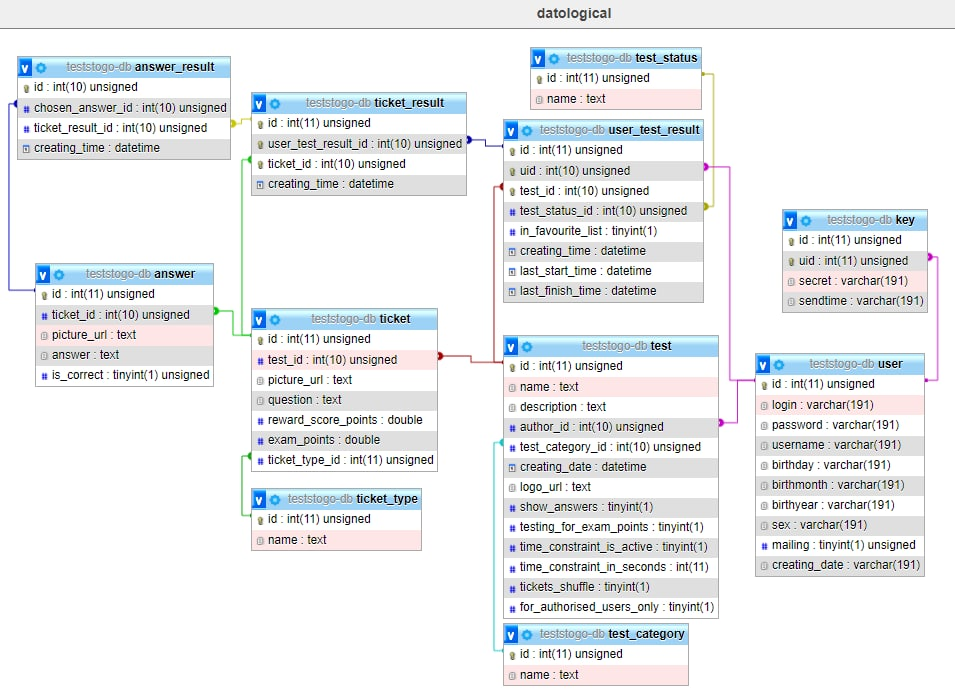
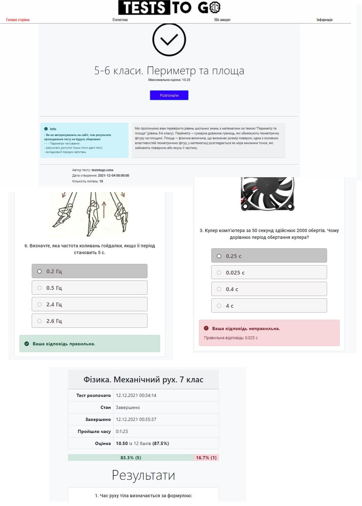

# Tests to GO

## Description

Platform that supports tests and quizzes passing. 
Has Tests Wizard that allows you to create and flexibly customize each test separately
(time limits / number of passes / exam mode, and so on), monitor your testing statistics, 
There are Rating Table, in which you can compete with other experts.

## Table of Contents

- [Getting started](#getting-started)
- [Technologies used](#technologies-used)
- [Demo](#demo)

## Getting started

1. Clone this repo using `git clone <URL>`
2. Run `docker-compose up`
3. Create schema and bootstrap data in `mysql` image DB by executing [SQL script](mysql_queries/teststogo-db.sql)
4. Open application via `localhost:8080`

## Technologies used

- HTML
- Bootstrap
- CSS
- Javascript
- JQuery
- AJAX
- PHP
- MySQL
- RedBean
- Sendmail

## Demo

Domain model diagram:  

Site features:  

